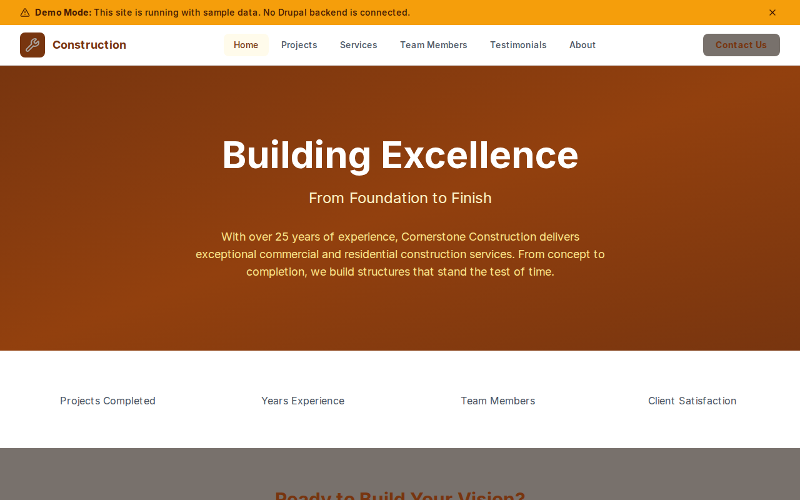

# Decoupled Construction

A construction company website starter template for Decoupled Drupal + Next.js. Built for general contractors, construction firms, and building companies.



## Features

- **Project Portfolio** - Showcase completed construction projects with images, budgets, locations, and project types (commercial, residential, industrial)
- **Services** - Detail construction services offered with service areas and descriptions
- **Team Directory** - Team member profiles with positions, contact info, and bios
- **Client Testimonials** - Display client reviews with ratings and project references
- **Modern Design** - Clean, accessible UI optimized for construction industry content

## Quick Start

### 1. Clone the template

```bash
npx degit nextagencyio/decoupled-construction my-construction
cd my-construction
npm install
```

### 2. Run interactive setup

```bash
npm run setup
```

This interactive script will:
- Authenticate with Decoupled.io (opens browser)
- Create a new Drupal space
- Wait for provisioning (~90 seconds)
- Configure your `.env.local` file
- Import sample content

### 3. Start development

```bash
npm run dev
```

Visit [http://localhost:3000](http://localhost:3000)

---

## Manual Setup

<details>
<summary>Click to expand manual setup steps</summary>

### Authenticate with Decoupled.io

```bash
npx decoupled-cli@latest auth login
```

### Create a Drupal space

```bash
npx decoupled-cli@latest spaces create "My Construction"
```

Note the space ID returned. Wait ~90 seconds for provisioning.

### Configure environment

```bash
npx decoupled-cli@latest spaces env 1234 --write .env.local
```

### Import content

```bash
npm run setup-content
```

This imports:
- Homepage with hero, statistics, and CTAs
- 4 Construction Projects (commercial, residential, healthcare, industrial)
- 4 Services (commercial, residential, renovation, industrial)
- 3 Team Members
- 3 Client Testimonials
- 2 Static Pages (About, Contact)

</details>

## Content Types

### Project
- **title**: Project name
- **body**: Detailed project description with highlights
- **project_type**: Type of construction (commercial, residential, industrial, healthcare)
- **location**: Project location
- **year_completed**: Completion year
- **budget**: Project budget
- **image**: Featured project image
- **featured**: Whether to feature on homepage

### Service
- **title**: Service name
- **body**: Service description with offerings
- **service_area**: Geographic areas served
- **image**: Service image

### Team Member
- **title**: Team member name
- **body**: Biography
- **position**: Job title
- **email**: Contact email
- **phone**: Contact phone
- **photo**: Profile photo

### Testimonial
- **title**: Testimonial headline
- **body**: Client review text
- **client_name**: Name of the client
- **project_name**: Associated project
- **photo**: Client photo
- **rating**: Star rating (1-5)

## Customization

### Colors & Branding
Edit `tailwind.config.js` to customize colors, fonts, and spacing.

### Content Structure
Modify `data/construction-content.json` to add or change content types and sample content.

### Components
React components are in `app/components/`. Update them to match your design needs.

## Demo Mode

Demo mode allows you to showcase the application without connecting to a Drupal backend.

### Enable Demo Mode

```bash
NEXT_PUBLIC_DEMO_MODE=true
```

### Removing Demo Mode

1. Delete `lib/demo-mode.ts`
2. Delete `data/mock/` directory
3. Delete `app/components/DemoModeBanner.tsx`
4. Remove `DemoModeBanner` from `app/layout.tsx`
5. Remove demo mode checks from `app/api/graphql/route.ts`

## Deployment

### Vercel (Recommended)
[](https://vercel.com/new/clone?repository-url=https://github.com/nextagencyio/decoupled-construction)

### Other Platforms
Works with any Node.js hosting platform that supports Next.js.

## Documentation

- [Decoupled.io Docs](https://www.decoupled.io/docs)
- [Next.js Documentation](https://nextjs.org/docs)
- [Drupal GraphQL](https://www.decoupled.io/docs/graphql)

## License

MIT
